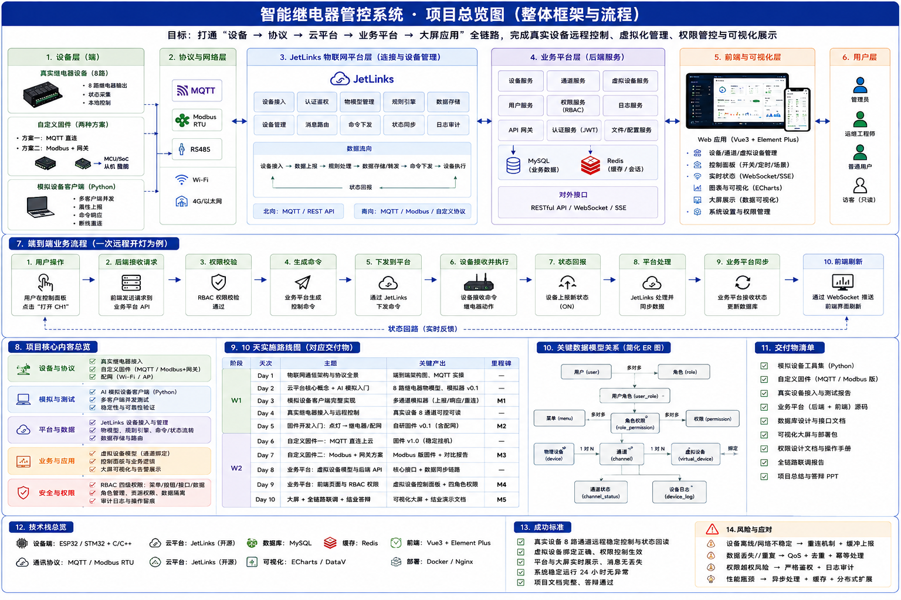
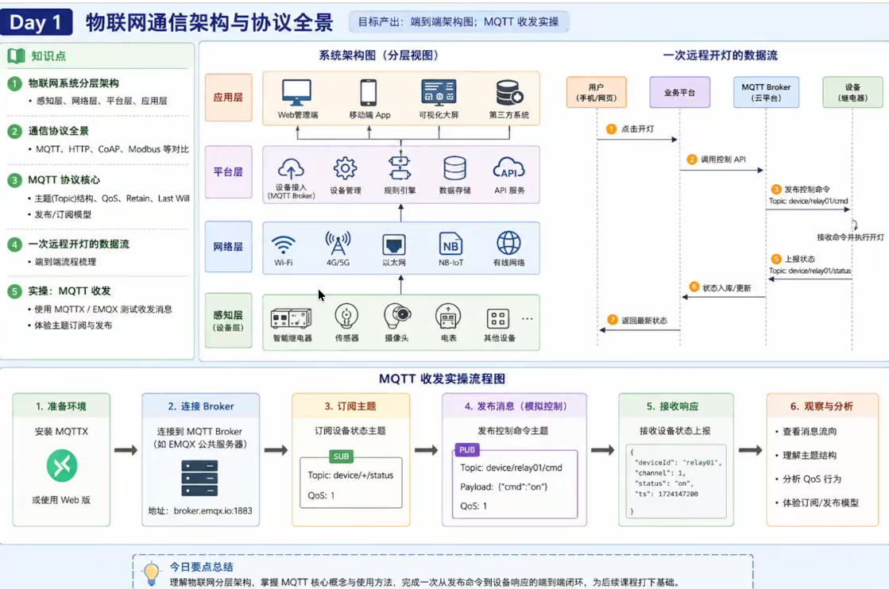
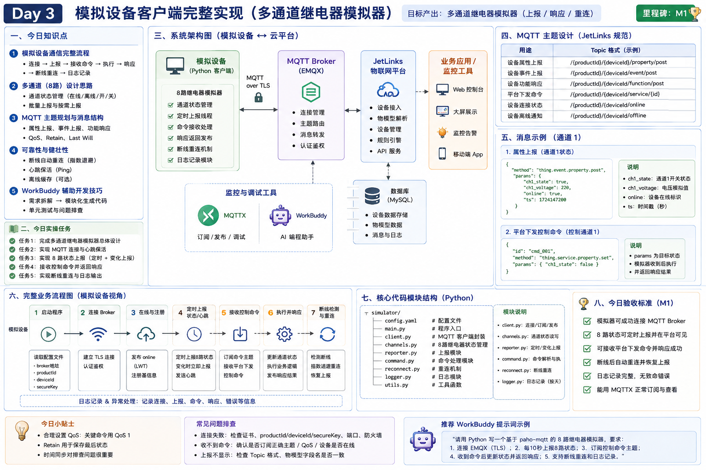
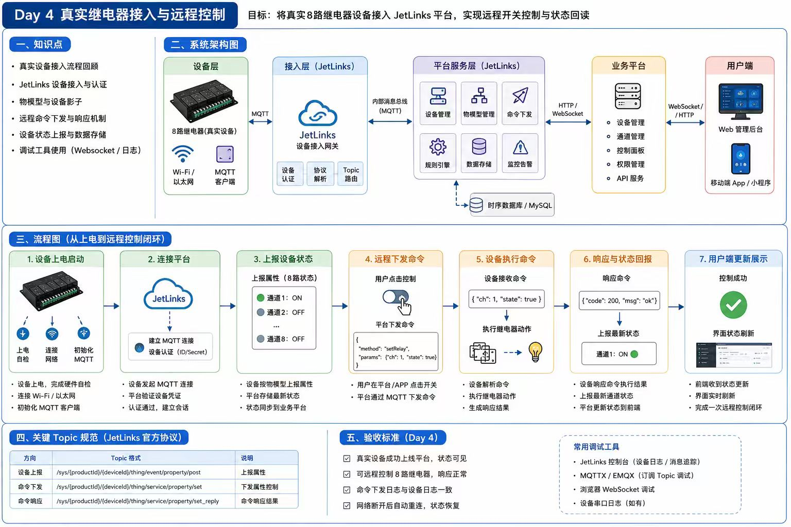
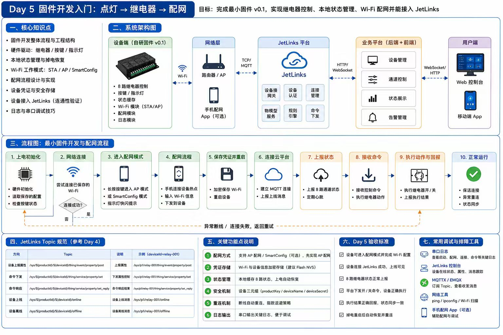
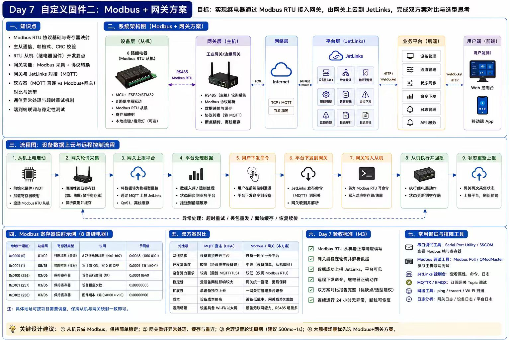

# 智能继电器控制系统

> Day1 ~ Day7 完整记录 | ESP32-C3 + MicroPython + Modbus + MQTT + JetLinks

---

## 一、项目在干什么

想象一个智能大棚场景：

```
大棚里: 温度传感器、湿度传感器、4 个通风/浇水继电器
    ↓ RS485 串口或以太网 ↓
Modbus 从站（传感器盒子）
    ↓ WiFi ↓
ESP32-C3 开发板（网关）
    ↓ MQTT ↓
JetLinks 物联网平台（云服务器 172.16.4.211）
    ↓ 浏览器/App ↓
你坐在电脑前看数据、点按钮控制继电器
```



ESP32 固件是中间那台"网关"，它干 3 件事：
1. **往下**：通过 Modbus TCP 读传感器寄存器、写继电器开关
2. **往上**：通过 MQTT 把数据上报 JetLinks、接收控制指令
3. **自己**：管理 4 路继电器 GPIO、处理按键、断线重连

### 接线（ESP32-C3 四路继电器开发板）

| 继电器 | GPIO | 说明 |
|--------|------|------|
| 继电器 1 | GPIO 3 | 高电平触发 |
| 继电器 2 | GPIO 4 | 高电平触发 |
| 继电器 3 | GPIO 5 | 高电平触发 |
| 继电器 4 | GPIO 7 | 高电平触发 |

| 按键 | GPIO | 功能 |
|------|------|------|
| SW1 | GPIO 10 | 短按切继电器1，**长按6秒进配网模式** |
| SW2 | GPIO 9 | 短按切继电器2，双击切全部开关 |
| SW3 | GPIO 6 | 短按切继电器3 |
| SW4 | GPIO 8 | 短按切继电器4 |

---

## 二、环境准备（一次性）

```powershell
# Python 依赖
pip install pymodbus paho-mqtt flask esptool mpremote pyserial

# MQTTX 客户端 (下载安装)
# https://mqttx.app/zh

# JetLinks 平台（老师提供）
# http://172.16.4.211  账号 admin7 / 密码见平台
```


### JetLinks 连接信息速查

| 项 | 值 |
|----|-----|
| JetLinks 地址 | http://172.16.4.211 |
| MQTT Broker | EMQX 172.16.4.211:9783 |
| MQTT 账号 | test |
| MQTT 密码 | 123456 |
| 产品 ID | relay-cc |
| 设备 ID | relaycc |

### MQTTX 新建连接

| 项 | 值 |
|----|-----|
| Host | 172.16.4.211 |
| Port | 9783 |
| Username | test |
| Password | 123456 |

订阅 `relaycc/#` 可看到板子所有收发消息。

---

## 三、Day1：PC 端温湿度模拟器

### 目标
在电脑上跑一个 Modbus TCP 从站模拟器，模拟一个有温湿度寄存器的传感器，验证 Modbus 协议基本通信。



### 运行指令

```powershell
cd simulator\tools
python modbus_slave_sim.py 5502 7
```

| 参数 | 说明 |
|------|------|
| 5502 | 监听端口（Modbus TCP 默认 502，5502 避免权限问题） |
| 7 | 从站地址 (unit_id) |

### 寄存器布局

| 寄存器 | 名称 | 格式 | 初始值 |
|--------|------|------|--------|
| reg0 | 温度 | ×10, uint16 | 253 (25.3°C) |
| reg1 | 湿度 | ×10, uint16 | 567 (56.7%RH) |
| reg2~9 | 继电器1~8 | uint16, 0/1 | 0 |
| reg10 | 总电流 | ×10, uint16 | 0.0A |
| reg11 | 电压 | ×10, uint16 | 220.0V |

温湿度每 2 秒随机漂移一次。

### 验证 Modbus 通信

用 Modbus Poll / QModMaster 连接 `127.0.0.1:5502`，unit_id=7，读 reg0~reg1：
- 如果读到 253 和 567 → ✅ Modbus 通信正常
- 如果超时 → 检查模拟器是否在跑、Windows 防火墙是否放行 5502

### 文件说明

| 文件 | 作用 |
|------|------|
| `simulator/tools/modbus_slave_sim.py` | Modbus TCP 从站模拟器（温湿度漂移 + 8 路继电器） |
| `simulator/day1/sensor_simulator.py` | 早期纯 Modbus 模拟器（不带 MQTT） |

---

## 四、Day2：PC 端继电器模拟器 + JetLinks 上报

### 目标
8 路继电器模拟器，**JetLinks MQTT 直连上报**，同时作为 Modbus TCP 从站——PC 端模拟整个"继电器设备"的行为。

### 运行指令

```powershell
# 方式1: 双击 start_relay.bat
# 方式2: 手动运行
cd simulator\day2
python relay_simulator_jl.py
```

### 配置文件

`simulator/day2/config_relay.json`：

```json
{
  "modbus": {
    "host": "127.0.0.1",
    "port": 5502,
    "unit_id": 7,
    "register_start": 2,
    "register_count": 8
  }
}
```

| 字段 | 说明 |
|------|------|
| host | Modbus 从站 IP（模拟器自己就是从站，写 127.0.0.1） |
| port | Modbus 端口 |
| unit_id | 从站地址 |
| register_start | 继电器对应的寄存器起始地址 |
| register_count | 继电器寄存器数量（8 路） |

### 文件说明

| 文件 | 作用 |
|------|------|
| `relay_simulator_jl.py` | 8 路继电器模拟器（JetLinks MQTT 直连 + Modbus TCP 从站） |
| `sensor_simulator_jl.py` | 温湿度传感器模拟器（JetLinks 直连） |
| `config_relay.json` | 继电器模拟器 Modbus 配置 |
| `config_jetlinks.json` | MQTT / JetLinks 连接配置 |
| `emqx_rule.sql` | EMQX 规则引擎 SQL（可选，用于旧版消息转换） |
| `test_format_compare.py` | 两种上报格式对比测试 |
| `start_relay.bat` | 双击启动继电器模拟器 |
| `start_sensor.bat` | 双击启动温湿度模拟器 |

### 验证流程

1. 启动 `modbus_slave_sim.py`（提供温湿度寄存器）
2. 启动 `relay_simulator_jl.py`（读 Modbus 继电器寄存器 + MQTT 上报）
3. JetLinks 平台设备管理找到 `relaycc` → 属性页刷新 → 应看到 relay1~8 + temperature + humidity
4. 平台下发 `set_relay` 指令 → 模拟器日志应显示收到并执行

---

## 五、Day3：继电器 Web UI

### 目标
用 Flask 做一个 Web 控制台，两种模式：MQTT 链路模式（走平台）和直连 Modbus 模式（直接读寄存器）。



### 运行指令

```powershell
cd simulator\day2
python relay_ui.py
# 或双击 start_ui.bat
```

浏览器打开 **http://localhost:8081**

### 两种模式区别

| 模式 | 链路 | 适用场景 |
|------|------|---------|
| MQTT 链路 | UI → EMQX → JetLinks → 模拟器 | 看到真实消息日志 |
| 直连 Modbus | UI → Modbus TCP 5502 | 调试从站/实物时绕过平台 |

### 运行前置

- MQTT 链路模式：需要 `relay_simulator_jl.py` + EMQX 可达
- 直连模式：需要 `modbus_slave_sim.py` 在 5502 端口监听

### 文件说明

| 文件 | 作用 |
|------|------|
| `relay_ui.py` | Flask Web UI（嵌入 HTML 前端 + API 后端） |

---

## 六、Day4：JetLinks 平台对接

### 目标
完成 JetLinks 平台的配置，让 PC 端模拟器能上报数据、接收指令。



### 步骤 1：设备接入网关

运维管理 → 设备接入网关 → MQTT Broker 接入

| 项 | 值 |
|----|-----|
| Broker 地址 | 172.16.4.211 |
| 端口 | 9783 |
| 用户名 | test |
| 密码 | 123456 |

### 步骤 2：产品物模型

产品管理 → 新建产品 → `relay-cc` → 物模型

#### 属性定义

| 属性 ID | 名称 | 数据类型 | 读写 |
|---------|------|---------|------|
| `relay1` | 继电器1 | int(整数型) | 读写 |
| `relay2` | 继电器2 | int(整数型) | 读写 |
| `relay3` | 继电器3 | int(整数型) | 读写 |
| `relay4` | 继电器4 | int(整数型) | 读写 |
| `relay5` | 继电器5 | int(整数型) | 读写 |
| `relay6` | 继电器6 | int(整数型) | 读写 |
| `relay7` | 继电器7 | int(整数型) | 读写 |
| `relay8` | 继电器8 | int(整数型) | 读写 |
| `temperature` | 温度 | double(双精度浮点) | 读 |
| `humidity` | 湿度 | double(双精度浮点) | 读 |

⚠️ **属性 ID 必须和固件上报的 key 完全一致**，否则平台静默丢弃该字段。

#### 功能定义

| 功能 ID | 名称 | 输入参数 | 说明 |
|---------|------|---------|------|
| `set_relay` | 设置单个继电器 | 继电器编号(int), 状态(int) | 继电器编号 1~4，状态 0/1 |
| `all_on` | 全部打开 | 无 | |
| `all_off` | 全部关闭 | 无 | |
| `toggle_relay` | 切换继电器 | 继电器编号(int) | |
| `batch_set` | 批量设置 | 继电器数组, 状态数组 | |

### 步骤 3：创建设备

产品管理 → `relay-cc` → 设备 → 新增：
- 设备 ID：`relaycc`
- 设备名称：继电器CC

### JetLinks 会话僵死问题

如果设备显示"在线"但收不到新消息（最后上线时间停在旧时间点）：
1. 设备详情页点 **"断开连接"** 清除僵死会话
2. 重启模拟器/固件

---

## 七、Day5：ESP32 继电器固件（核心里程碑）

### 目标
用 MicroPython 给 ESP32-C3 开发板写完整固件，替代 PC 模拟器，实现：
- ✅ 4 路继电器 GPIO 控制
- ✅ SW1~SW4 按键扫描（Timer 定时）
- ✅ AP 配网模式（SW1 长按 6 秒触发）
- ✅ MQTT 直连 JetLinks（断线指数退避重连）
- ✅ 持久化配置（/config.json 原子写）



### 7.1 固件烧录

#### 环境依赖

```powershell
pip install esptool mpremote pyserial
```

#### 擦除旧固件

```powershell
python -m esptool --port COM5 erase_flash
```

#### 烧录 MicroPython 解释器

```powershell
python -m esptool --port COM5 --chip esp32c3 flash_mode dio --flash_freq 40m flash_id simulator/esp32/_firmware/ESP32_GENERIC_C3-v1.29.0.bin
```

烧录完成后板子自动重启。

#### 上传固件源码

```powershell
cd simulator\esp32

# 核心文件
python -m mpremote connect COM5 cp boot.py :/boot.py
python -m mpremote connect COM5 cp app_config.py :/app_config.py
python -m mpremote connect COM5 cp relay_hw.py :/relay_hw.py
python -m mpremote connect COM5 cp ap_config.py :/ap_config.py
python -m mpremote connect COM5 cp main.py :/main.py

# umqtt 库（如果板子上没有）
python -m mpremote connect COM5 mkdir umqtt
python -m mpremote connect COM5 cp umqtt/simple.py :umqtt/simple.py
```

#### 串口日志监控

```powershell
# 方式1: 双击 start_serial.bat
# 方式2: 手动运行
python -c "import serial,time; s=serial.Serial('COM5',115200,timeout=1); time.sleep(2); print(s.read(s.in_waiting or 4096).decode('utf-8','replace')); s.close()"
```

预期看到：
```
boot: ESP32 启动, MAC = 7ce8b1c1a798
[main] 设备启动, MAC = 7ce8b1c1a798
[main] 连接WiFi: Office-WiFi
[main] WiFi OK, IP: 192.168.30.145
[main] MQTT 已连接 172.16.4.211:9783 设备=relaycc
```

### 7.2 配网流程

#### 进入配网模式

| 方式 | 操作 | 场景 |
|------|------|------|
| 自动进入 | 板子 `/config.json` 不存在或 `is_ready()` 返回 False | 首次开机 |
| SW1 长按 | **长按 SW1 约 6 秒**松开 | 正常运行时想改配置 |

串口确认：
```
[relay_hw] SW1 长按5秒: 请求进入配网模式
[main] 收到配网请求, 切换到配网模式
[ap] 热点已开放: RELAY-SETUP-a799 (开放网络)
[ap] 手机连热点后打开 http://192.168.4.1
```

#### 手机配网

1. 手机 WiFi 找 **`RELAY-SETUP-xxxx`**（开放网络，无密码）
2. 浏览器打开 **http://192.168.4.1**（必须 http://，不能 https://）
3. 关掉手机蜂窝数据（避免 4G 抢流量）
4. 填写配置：

| 卡片 | 字段 | 示例 |
|------|------|------|
| 📶 WiFi | WiFi 名称 | `Office-WiFi` |
| | WiFi 密码 | `yh82922868` |
| ☁️ MQTT | MQTT 服务器 IP | `172.16.4.211` |
| | 端口 | `9783` |
| | 账号 | `test` |
| | 密码 | `123456` |
| | 产品 ID | `relay-cc` |
| | 设备 ID | `relaycc`（默认填 MAC 后 4 位） |

5. 点 **"保存并重启"**

#### 命令行快速改配置（不用进配网）

```powershell
python -m mpremote connect COM5 exec "
import app_config
c = app_config.load()
c['device_id'] = 'relaycc'
c['wifi_ssid'] = 'Office-WiFi'
app_config.save(c)
print('OK')
"
python -m mpremote connect COM5 reset
```

### 7.3 ESP32 固件文件逐个讲解

#### boot.py — 启动入口（最先执行）

```python
# boot.py
import time, network
from app_config import load

def main():
    cfg = load()
    if cfg and cfg.get("wifi_ssid"):
        # 正常运行: 连 WiFi
        sta = network.WLAN(network.STA_IF)
        sta.active(True)
        sta.connect(cfg["wifi_ssid"], cfg.get("wifi_pass", ""))
        # 等 main.py 接管后续

main()
```

**执行顺序**：ESP32 上电 → boot.py 自动执行 → main.py 执行（如果存在）

| 作用 | 说明 |
|------|------|
| 最先跑 | MicroPython 约定，boot.py 比 main.py 先执行 |
| 预连 WiFi | 提前启动 WiFi STA 模式，main.py 拿到配置后立即开始连接 |
| 轻量 | 不做太多事，避免启动时卡住 |

#### app_config.py — 配置持久化

```python
# app_config.py
CONFIG_PATH = "/config.json"

DEFAULTS = {
    "wifi_ssid": "",
    "wifi_pass": "",
    "mqtt_host": "172.16.4.211",
    "mqtt_port": 9783,
    "mqtt_user": "test",
    "mqtt_pass": "123456",
    "product_id": "relay-cc",
    "device_id": "",          # 空 → 自动填 MAC
    "modbus_enabled": False,  # Day7 新增
    "modbus_slaves": [],      # Day7 新增
}

REQUIRED = ("wifi_ssid", "mqtt_host", "device_id")
```

| 函数 | 作用 |
|------|------|
| `load()` | 读 config.json，不存在/损坏返回 None，存在则补全默认值 |
| `is_ready(cfg)` | 所有 REQUIRED 字段非空 → 足够进正常模式 |
| `save(cfg)` | 先写 .tmp 再 os.rename()，**原子写**防止掉电损坏 |
| `mac_address()` | 读设备 MAC，用于默认 device_id |

**原子写**：
```python
def save(cfg):
    tmp = CONFIG_PATH + ".tmp"
    with open(tmp, "w") as f:
        f.write(json.dumps(cfg))
    os.rename(tmp, CONFIG_PATH)  # 原子操作，要么全写要么全不写
```

#### relay_hw.py — GPIO 控制 + 按键扫描

```python
# relay_hw.py
RELAY_PINS = [3, 4, 5, 7]    # 4 路继电器 GPIO
BTN_PINS   = [10, 9, 6, 8]   # SW1~SW4 GPIO

RELAY_ACTIVE_LOW = False     # 实物测试: 高电平触发
```

| 函数/对象 | 作用 |
|-----------|------|
| `states()` | 返回当前 4 路继电器状态 `[1,0,1,0]` |
| `set(idx, on)` | 设置第 idx 路继电器开关（idx=0~3） |
| `config_requested()` | SW1 是否长按了 6 秒（配网模式触发器） |
| `attach_buttons()` | 启动 Timer(0)，每 50ms 扫一次按键 |
| Timer 回调 | 检测按下/松开/长按，触发回调 |

**长按判定逻辑**：
```
按键按下 → start_time 记录
持续按住 → 每秒检查是否够 6 秒
够了 → config_request = True → 主循环检测到后切配网模式
松开 → 重置 start_time
```

#### ap_config.py — AP 热点 + HTTP 配网页

| 函数 | 作用 |
|------|------|
| `start_ap()` | 关 STA、开 AP 热点 `RELAY-SETUP-xxxx`，IP 设 192.168.4.1 |
| `run(cfg)` | 启动 HTTP 服务器（socket 手写，无 Flask），阻塞服务 |
| `_html_form(cfg)` | 生成配网 HTML 表单（WiFi + MQTT + Day7 Modbus 卡片） |
| `_parse_form(body)` | application/x-www-form-urlencoded 表单解析 |

**HTTP 服务器**：MicroPython 没有 Flask，用 `socket.socket()` 手写，监听 80 端口。GET 返回表单，POST 保存配置。

**Day7 新增卡片**：Modbus 采集配置 JSON 文本域，用户直接贴 JSON 配置。

#### 📌 Day7 踩坑：ESP32-C3 时钟系统（JetLinks 更新时间 1970 之谜）

**问题现象**：JetLinks 上所有属性的"更新时间"全是 `1970-01-01`，即使板子已经联网、MQTT 正常上报。

**根因一层层挖**（共 4 层坑，每修一层才暴露下一层）：

**坑 1：没 import `ntptime`**

Day5 固件 `main.py` 里根本没有 NTP 校时代码，`now_ms() = time.time() * 1000` 返回的是板子**开机秒数**（比如 120 秒 → JetLinks 收到 `1970-01-01 00:02:00`）。

修：WiFi 连上后调 `ntptime.settime()` 同步时间。

**坑 2：WiFi 已连时跳过了校时**

ESP32 STA 模式上电自动重连（记住了 WiFi 凭据），代码里：

```python
if _wlan.isconnected():
    return True   # ← 直接返回，跳过了 _ntp_sync()
```

修：已连也跑 `_ntp_sync()`。

**坑 3：`ntptime.settime()` 调了，但 `time.time()` 没变！（最坑）**

这是 **ESP32-C3 MicroPython 的一个特性**——板子上有两个"时钟"：

| 时钟 | 比喻 | 谁在管 |
|------|------|--------|
| `time.time()` | **秒表**（开机后从零数秒） | FreeRTOS tick counter |
| `machine.RTC().datetime()` | **电子表**（可以调日期） | RTC 硬件 |

`ntptime.settime()` 确实连了 NTP、确实更新了 RTC（电子表变成 2026-09-07），但 `time.time()` 继续从开机数——两个时钟互相不通信。

解决：**偏移量方案**，把"真实 epoch - 开机秒数"差记住，每次 `now_ms()` 就加：

```python
_NTP_OFFSET = 0          # NTP 同步后赋值

def _compute_epoch(dt):
    """从 RTC datetime 自己算 Unix epoch (MicroPython 没 calendar 模块)"""
    Y, M, D, H, Mi, S = dt[:6]
    total_days = (Y - 1970) * 365
    leaps = sum(1 for y in range(1970, Y)
                if (y % 4 == 0 and y % 100 != 0) or y % 400 == 0)
    total_days += leaps
    days_in_month = [31,28,31,30,31,30,31,31,30,31,30,31]
    if (Y % 4 == 0 and Y % 100 != 0) or Y % 400 == 0:
        days_in_month[1] = 29
    total_days += sum(days_in_month[:M-1]) + (D-1)
    return total_days * 86400 + H*3600 + Mi*60 + S

def _ntp_sync():
    global _NTP_OFFSET
    ntptime.host = "ntp.aliyun.com"     # 国内比 pool.ntp.org 快
    ntptime.settime()
    rtc_dt = machine.RTC().datetime()    # 电子表 (已被 NTP 调准)
    real_epoch = _compute_epoch(rtc_dt)  # 从电子表算真实 epoch
    boot_counter = int(time.time())      # 秒表 (开机秒数)
    _NTP_OFFSET = real_epoch - boot_counter

def now_ms():
    return int((time.time() + _NTP_OFFSET) * 1000)
```

**坑 4：日历自己写 off-by-one，少了 365 天**

写 `_compute_epoch` 时犯了个低级数组分配错误：

```python
# ❌ 旧: Y-1-1970 个元素, Y=2026 时只有 55 个
DAYS_PER_YEAR = [365] * (Y - 1 - 1970)

# ✅ 新: 直接算, 不靠数组
total_days = (Y - 1970) * 365
```

差了 1 年（365 天 × 86400 秒），JetLinks 上显示 `2025-09-07`。

**坑 5：`mpremote cp` 报 Up to date 实际没覆盖**

`mpremote cp` 只比较文件 size，不比较内容。如果你在本地改了文件但 size 没变（或更小），它报 "Up to date" 直接跳过。修：先 `mpremote rm main.py` 再 `cp`。

```powershell
python -m mpremote connect COM5 rm main.py      # 先删板子上的
python -m mpremote connect COM5 cp main.py :/main.py   # 再强制上传
python -m mpremote connect COM5 reset           # 重启
```

### 时间戳验证速查

板子跑起来后串口应该能看到：

```
[main] WiFi already connected, IP: 192.168.30.145
[main] [TIME] real_epoch: 1788739596 boot: 842077xxx offset: 94666xxxx
[main] [TIME] now_ms() => 1788739596000  local(UTC): (2026, 9, 7, 8, 7, 16)
```

- `real_epoch` 应该在 1,788,7xx,xxx 量级（2026 年）
- `boot` 是开机秒数（~842,077,xxx，假 epoch）
- `now_ms()` 应该 ≈ `real_epoch * 1000`

如果 JetLinks 更新时间还是 1970：板子可能跑了旧 main.py → `rm + cp + reset` 强制覆盖。

#### modbus_gw.py — ⭐ Day7 新增，Modbus TCP 主站 + 时间片调度

这是 Day7 的核心，拆成三层：

**第一层：Modbus TCP 帧编解码**

```python
def _mbap(unit_id, pdu):
    """构造 Modbus TCP 帧 (MBAP头 + PDU)"""
    tid = _next_tid()                    # 事务ID，每次+1
    length = 1 + len(pdu)                # 长度 = 从站ID + PDU 长度
    mbap = struct.pack(">HHHB", tid, 0, length, unit_id)  # 大端打包
    return mbap + pdu, tid

def _parse_response(frame, expected_tid):
    """解析 Modbus TCP 响应帧"""
    tid, proto, length, unit_id = struct.unpack(">HHHB", frame[:7])  # 拆 MBAP 头
    # 校验 事务ID + 协议ID
    pdu = frame[7:7 + length]                                        # 拆 PDU
    ...

def _decode_registers(raw, count, dtype):
    """按 dtype 解码寄存器字节"""
    # uint16 / int16 / uint32 / int32 / float_be
    return struct.unpack(...)
```

Modbus TCP 帧结构：
```
MBAP 头 (7 字节)          PDU 载荷
┌─────────────────────┐ ┌──────────────────┐
│ 事务ID(2)│协议ID(2)  │ │功能码(1)+数据     │
│ 长度(2)  │从站ID(1) │ │                   │
└─────────────────────┘ └──────────────────┘
全部大端字节序 (">")
```

**第二层：Socket 连接管理（_SlaveConn）**

```python
class _SlaveConn:
    def __init__(self, host, port):
        self.sock = None          # socket 对象（None = 未连接）
        self.fail_count = 0       # 连续失败次数
        self.retry_after = 0      # 冷却截止时间（Unix ms）

    def _in_cooldown(self):
        return self.retry_after and time.ticks_ms() < self.retry_after

    def read_holding(self, unit_id, start_addr, count):
        if self._in_cooldown():   # ① 冷却中 → 直接跳过，零阻塞
            return None
        if self.sock is None:     # ② 先连一次
            if not self.connect():
                return None
        # ③ 发请求、等响应
        self.sock.sendall(frame)
        head = self._recv_exact(7)   # MBAP 头
        pdu = self._recv_exact(pdu_len)  # PDU
        ...
```

**冷却机制**：连续失败 3 次 → `retry_after = now + 30秒` → 30 秒内 `_in_cooldown()` 返回 True → 所有采集点直接返回 None，**不发起任何 socket 操作，主循环零阻塞**。

**第三层：时间片轮询调度（ModbusGateway）**

```python
class ModbusGateway:
    def poll_one(self):
        # ① 找最早到期的采集点
        now = time.ticks_ms()
        best = None
        for pt in self.points:
            if now >= pt["next_due"]:
                if best is None or pt["next_due"] < best["next_due"]:
                    best = pt

        if best is None:
            return   # 全部没到期，直接返回！

        # ② 只采这一个点
        regs = conn.read_holding(best["unit_id"], best["addr"], best["count"])
        val = _decode_registers(regs, best["count"], best["type"])
        if best.get("scale"):           # Day7: scale 缩放
            val = round(val * best["scale"], 2)
        self.values[best["key"]] = val

        # ③ 安排下次采集时间
        best["next_due"] = time.ticks_add(now, best["period"])
        #                 ↑ 注意: now + period，不是 next_due + period
        #                 锚定实际执行时刻，避免漂移累积
```

**为什么是 `now + period` 不是 `next_due + period`**：
- 如果用后者，每次实际采集晚的几十毫秒会累积，周期慢慢变长
- 用 `now + period` 把每次实际时刻当新基准，**漂移被重置**

**初始 next_due 偏移**：
```python
"next_due": time.ticks_add(time.ticks_ms(), 1000 + pi * 500)
# pi 是点在数组里的索引: 第1个+1000, 第2个+1500, 第3个+2000
# 启动瞬间天然错开，避免同时爆发
```

#### 📌 Day7 新增：JetLinks 下发属性 → 写 Modbus 从站寄存器

**为什么要加这个**：Day1-4 PC 模拟器时 JetLinks 下发温湿度能生效，是因为模拟器自己存 json 文件、自己改。ESP32 固件里温湿度是"读"Modbus 来的——ESP32 本身不"持有"温度值，之前 JetLinks 下发 `temperature: 26` 时 `apply_props` 里写着 `if not k.startswith("relay"): continue`，**所有非 relay key 直接跳过**。

**实现链路**：

```
JetLinks 编辑 temperature=26
    ↓ MQTT /properties/write: {"properties": {"temperature": 26}}
main.py on_msg → apply_props
    │ relay1~4 → relay_hw.set()         (GPIO)
    │ temperature → modbus_gw.write()    (Modbus 0x06) ← 新增!
    ↓
modbus_gw.py _write_info["temperature"]
    = {conn, unit_id=7, addr=0x0000, scale=0.1}
    reg_val = round(26.0 / 0.1) = 260   ← scale 反向换算
    ↓
Modbus TCP 功能码 0x06: 写 0x0000 = 260
    ↓
PC 模拟器 REGS[0] = 260 → 温度 = 26.0°C
    ↓
模拟器 drift() 在 260 附近继续小漂 (模拟真实设备)
ESP32 poll_one 下次读 → 25.8 → 26.1 → 26.3 → ...
```

**modbus_gw.py write 相关数据结构**：
```python
# 初始化时为每个带 key 的采集点建反向映射
self._write_info[pkey] = {
    "conn": conn,
    "unit_id": unit_id,
    "addr": addr,
    "scale": scale,
}

# JetLinks 下发 → 查表 → 写寄存器
def ModbusGateway.write(self, key, value):
    info = self._write_info[key]
    reg_val = int(round(value / info["scale"]))   # 反向: 用户值 → 寄存器值
    return info["conn"].write_holding(info["unit_id"], info["addr"], reg_val)
```

**main.py apply_props 扩展**：
```python
# Day7 之前: 只处理 relay 开头的 key
if not k.startswith("relay"): continue

# Day7 之后: 非 relay key 尝试写 Modbus
else:
    if modbus_gw.supports_write(k):
        if modbus_gw.write(k, float(v)):
            applied[k] = float(v)
```

**main.py invoke 功能调用也支持**（JetLinks"产品功能"面板）：
```python
# functionId = "set_temp", inputs = {"temperature": 26}
elif fid in ("set_temp", "set_temperature", "set_modbus"):
    value = params.get("temperature", params.get("温度", params.get("目标温度")))
    modbus_gw.write("temperature", float(value))

# functionId = "set_humidity" / "set_hum"
elif fid in ("set_humidity", "set_hum"):
    modbus_gw.write("humidity", float(value))
```

参数名兼容：支持 `temperature` / `温度` / `temp` / `目标温度` 四种写法，JetLinks 物模型里叫英文或中文都行。

#### main.py — 主循环整合

```python
# main.py 启动流程
def run_normal(cfg):
    # 1. 连 WiFi
    # 2. 连 MQTT (指数退避重连)
    # 3. 初始化 Modbus 网关 (Day7)
    gw = modbus_gw.init(cfg.get("modbus_slaves", []))
    # 4. 启动按键 Timer
    relay_hw.attach_buttons()
    # 5. 进入 mqtt_loop()

# main.py mqtt_loop() 简化版
def mqtt_loop():
    while True:
        relay_hw.check_keys()        # 扫描按键（Timer 已在后台跑，这里检查 config_request）
        if relay_hw.config_requested():
            break                    # 跳出 → 进 ap_config.run()

        _cli.check_msg()             # 非阻塞处理 MQTT 下行命令

        gw.poll_one()                # ⭐ Day7 时间片：只采 1 个 Modbus 点

        _maybe_ping()                # 每 25 秒发一次 MQTT ping

        _maybe_report()              # 属性变化检测 → 上报

# main.py 上报合并
def properties():
    props = dict(relay_hw.states())       # {'relay1':1, 'relay2':0}
    props.update(gw.collected())          # {'temperature':26.6}  ← Day7
    return props                           # {'relay1':1, 'temperature':26.6}
```

**断线重连（指数退避）**：
```python
backoff = 5
while True:
    try:
        wifi_connect()
        mqtt_connect()
        mqtt_loop()
    except Exception:
        time.sleep(backoff)
        backoff = min(backoff * 2, 60)  # 5→10→20→40→60 封顶
```

#### config.py — 早期硬编码配置（已被 app_config 替代）

Day5 之前写死在代码里的配置，现在仅作参考。

#### main_modbus.py — 早期 Modbus 从站模式（测试用）

让 ESP32 自己当 Modbus TCP 从站，不用外部模拟器。功能简单，不支持配网。

#### main_mqtt.py — 早期 MQTT 直连模式（测试用）

Day5 之前的 MQTT 直连版本，硬编码配置。

#### serial_monitor.py — 串口监控辅助

旧版串口监控脚本，现在用 `start_serial.bat` 更方便。

---

## 八、Day6：双模式验证（MQTT 直连 vs Modbus+网关）

### 两种接入路线对比

| 对比项 | MQTT 直连 (Day5) | Modbus + 网关 (Day7) |
|--------|-----------------|---------------------|
| 网络结构 | ESP32 → JetLinks | ESP32 → Modbus 从站 + MQTT → JetLinks |
| 开发复杂度 | 较高（MQTT/TLS 协议在固件里） | 中等（固件简单，Modbus 协议简单） |
| 设备算力要求 | 较高（MQTT 栈 + TLS 加密） | 较低（仅 Modbus TCP） |
| 稳定性 | 受网络波动影响大 | 网关统一管理，更稳定 |
| 扩展性 | 每台设备独立上云 | 一网关可管理多台从站 |
| 适用场景 | 设备具备 WiFi/以太网 | 设备无联网能力，RS485 场景 |

### 路线验证

**MQTT 直连验证**（Day5 固件）：
1. 烧录 Day5 固件 → 配网 → MQTT 自动连 JetLinks
2. 平台下发 `set_relay` → 板子响应
3. 板子上报属性 → 平台显示

**Modbus+网关验证**（Day7 固件 + 外部模拟器）：
1. PC 启动 `modbus_slave_sim.py 5502 7`
2. ESP32 配网启用 Modbus，指向 PC IP:5502
3. 板子同时上报继电器状态 + Modbus 采集数据
4. MQTT 指令和 Modbus 采集不互相阻塞

---

## 九、Day7：Modbus 采集网关（核心功能详解）



### 9.1 配置格式

配网页面 Modbus 卡片填 JSON：

```json
[
  {
    "name": "温湿度传感器",
    "host": "192.168.30.100",
    "port": 502,
    "unit_id": 1,
    "points": [
      {"addr": "0x0000", "key": "temperature", "period_ms": 3000,
       "count": 1, "type": "uint16", "scale": 0.1},
      {"addr": "0x0001", "key": "humidity",    "period_ms": 5000,
       "count": 1, "type": "uint16", "scale": 0.1}
    ]
  },
  {
    "name": "电压电表",
    "host": "192.168.30.101",
    "port": 502,
    "unit_id": 2,
    "points": [
      {"addr": "0x0000", "key": "voltage", "period_ms": 10000,
       "count": 2, "type": "float_be"}
    ]
  }
]
```

### 9.2 字段速查

| 字段 | 类型 | 必填 | 说明 |
|------|------|------|------|
| `name` | string | 否 | 从站标识（仅日志用） |
| `host` | string | ✅ | Modbus TCP 从站 IP |
| `port` | int | ✅ | Modbus TCP 端口，默认 502 |
| `unit_id` | int | ✅ | 从站地址 1~247 |
| `addr` | string/int | ✅ | 寄存器地址，支持 `0x0000` 或十进制 |
| `key` | string | ✅ | 采集值对应的 JSON 属性名（JetLinks 物模型要配同名） |
| `period_ms` | int | ✅ | **每个点独立**的采集周期（毫秒） |
| `count` | int | 否 | 连续读取的寄存器数量，默认 1 |
| `type` | string | 否 | 数据类型，默认 `uint16` |
| `scale` | float | 否 | 缩放系数，如 `0.1` 表示原始值 × 0.1 |

### 9.3 type 可选值

| type | 占寄存器数 | 范围 | 说明 |
|------|-----------|------|------|
| `uint16` | 1 | 0~65535 | 无符号整数 |
| `int16` | 1 | -32768~32767 | 有符号整数 |
| `uint32` | 2 | 0~4294967295 | 大整数 |
| `int32` | 2 | ±2^31 | 有符号大整数 |
| `float_be` | 2 | ±3.4×10³⁸ | IEEE 754 大端浮点 |

### 9.4 scale 缩放系数

传感器寄存器常以 ×10 存储（266 = 26.6°C）。配置 `"scale": 0.1` 后，固件上报 26.6。

JetLinks 物模型属性类型必须选 **double(双精度浮点)**，否则小数会被截断。

### 9.5 验收测试清单

| # | 测试项 | 通过标志 |
|---|--------|---------|
| 1 | 板子启动 | WiFi OK + MQTT 已连 + Modbus 网关已启动 |
| 2 | 本地按键控制 | SW1~SW4 短按切换继电器，日志 + 灯都有 |
| 3 | JetLinks set_relay | 继电器编号=1,状态=0 → 灯灭 + 日志回复 |
| 4 | JetLinks all_on/all_off | 全开全关，4 路灯同步变化 |
| 5 | Modbus 采集 | 模拟器启动后日志出现 `[modbus] temperature = 26.6` |
| 6 | 数据上报合并 | 上报 payload 同时包含 relay1~4 和 temperature/humidity |
| 7 | 非阻塞 | 采集持续运行时按键和 MQTT 指令无延迟 |
| 8 | scale 生效 | 串口日志里 temperature 是 26.6 不是 266 |
| 9 | 冷却机制 | 关闭模拟器，日志出现"进入 3 秒冷却"且不再阻塞 |
| 10 | 配网改配置 | AP 模式改 Modbus JSON → 重启生效 |
| 11 | **JetLinks 下发温湿度** | 属性编辑面板改 temperature=26 → 模拟器日志出现 `写入寄存器 0x0000 : xxx → 260` → 板子日志出现 `write OK` → JetLinks 显示新值 |
| 12 | **产品功能调用** | 物模型加 `set_temp` / `set_humidity` 功能 → 功能调用面板输入值 → 同 #11 效果 |

### 9.6 JetLinks 产品功能配置（可选但推荐）

Day7 新增了 `set_temp` / `set_humidity` 功能调用支持，在 JetLinks 产品物模型里添加：

**功能 1：设置温度**
| 字段 | 值 |
|------|-----|
| 功能 ID | `set_temp` |
| 名称 | 设置温度 |
| 输入参数 | 名字 `temperature` 或 `温度`，类型 double |

**功能 2：设置湿度**
| 字段 | 值 |
|------|-----|
| 功能 ID | `set_humidity` |
| 名称 | 设置湿度 |
| 输入参数 | 名字 `humidity` 或 `湿度`，类型 double |

固件兼容 4 种参数名（`temperature` / `温度` / `temp` / `目标温度`），叫哪个都行。

### 9.7 模拟器稳定性改进

Day7 模拟器 `modbus_slave_sim.py` 两次迭代后变得稳定：

| 问题 | 修复 |
|------|------|
| **无 socket timeout** → 断线后线程泄漏 → 进程 OOM 崩溃 | `conn.settimeout(30)` + `socket.timeout` 捕获 → 30s 无报文自动清理 |
| **无服务异常恢复** → 任何 OS 异常直接死进程 | 外层 `while True + try/except OSError` → 3 秒后自动重启 |
| **冷却 30 秒太长** → 用户关开模拟器后等太久 | 从 15s → **3s**（足够模拟器重启，用户可接受） |

### 9.8 JetLinks 时间戳显示 8 小时差

JetLinks 显示时间比实际时间**少 8 小时**（比如板子 UTC epoch 正确，但 JetLinks 渲染成 UTC 时间而不是北京时间）——**这不是固件问题**。

根因：JetLinks 服务器/Docker 容器时区没设 `Asia/Shanghai`，它把 UTC epoch 直接按 UTC 格式渲染。

解决：
```yaml
# docker-compose.yml 加
environment:
  - TZ=Asia/Shanghai
# 或进容器手动
ln -sf /usr/share/zoneinfo/Asia/Shanghai /etc/localtime
```

固件上报的是 **正确 UTC Unix epoch 毫秒**（`1788739645000` = 2026-09-07 08:07:25 北京时间），符合 MQTT 协议规范——平台负责时区转换。

### 9.9 常见踩坑：关模拟器重开后 JetLinks 超时

完整的因果链：
```
你关模拟器窗口 → 进程消失
    ↓
板子 poll Modbus → ECONNREFUSED/RESET
    ↓
fail_count 累加: 1 → 2 → 3
    ↓
_on_fail() → retry_after = now + 3s → 进入冷却
    ↓
你重新开模拟器 → 5502 LISTENING ✅
    ↓
但板子还在冷却！poll_one 跳过所有点 → 不上报 → JetLinks 显示 --
    ↓
等 3 秒冷却到期后自动恢复
```

解决：
1. 冷却已从 15s → 3s，最多等 3 秒
2. 如果还嫌长，板子 reboot 也会清掉冷却状态

### 9.10 串口日志对照

| 日志行 | 含义 | 状态 |
|--------|------|------|
| `boot: ESP32 启动` | 硬件启动 | ✅ |
| `[main] 连接WiFi` | 配置有 WiFi | ✅ |
| `[main] WiFi OK, IP: xxx` | WiFi 连上 | ✅ |
| `[main] MQTT 已连接` | MQTT Broker 连上 | ✅ |
| `[main] Modbus 网关已启动, 采集点: 3` | Day7 网关初始化 | ✅ |
| `[modbus] temperature = 26.6` | **采集成功** | ✅ |
| `[modbus] 连接失败 ETIMEDOUT` | 从站不可达 | 检查防火墙/模拟器 |
| `[modbus] ... 进入 30 秒冷却` | 连续失败 3 次 | 等冷却自动重试 |

---

## 十、JetLinks MQTT 消息格式速查

### 10.1 上报（设备 → 平台）

```
Topic: /{productId}/{deviceId}/properties/report
示例:  /relay-cc/relaycc/properties/report
```

```json
{
  "timestamp": 1725678901234,
  "messageId": "esp32-7ce8b1c1a798-1725678901",
  "properties": {
    "relay1": 1,
    "relay2": 0,
    "relay3": 1,
    "relay4": 1,
    "temperature": 26.6,
    "humidity": 75.1
  }
}
```

### 10.2 功能调用（平台 → 设备）

```
Topic: /relay-cc/relaycc/function/invoke
```

三种参数格式，代码全兼容：

**格式 A（JetLinks 自动生成）**：
```json
{"messageId":"t1","functionId":"set_relay","inputs":[{"name":"继电器编号","value":1},{"name":"状态","value":0}]}
```

**格式 B（MQTTX 手动推荐）**：
```json
{"messageId":"t1","functionId":"set_relay","inputs":{"relay":1,"state":0}}
```

**格式 C（中文参数名）**：
```json
{"messageId":"t1","functionId":"set_relay","inputs":{"继电器编号":1,"状态":0}}
```

### 10.3 功能回复（设备 → 平台）

```
Topic: /relay-cc/relaycc/function/invoke/reply
```

```json
{"messageId":"t1","success":"success"}
```

### 10.4 属性写入（平台 → 设备）

```
Topic: /relay-cc/relaycc/properties/write
```

```json
{"messageId":"t2","properties":{"relay1":0}}
```

### 10.5 属性读取（平台 → 设备）

```
Topic: /relay-cc/relaycc/properties/read
```

```json
{"messageId":"t3","properties":["relay1","relay2"]}
```

---

## 十一、常见问题排查

### 11.1 板子串口无输出

| 可能 | 解决 |
|------|------|
| mpremote 卡在 REPL 模式 | 按复位键重启 |
| 串口端口被占用 | 关掉其他串口监控程序 |
| 波特率不对 | 必须是 115200 |

### 11.2 WiFi 连不上

| 可能 | 解决 |
|------|------|
| 密码错 | 长按 SW1 重配网 |
| 信号弱 | 换近点或用手机热点 |
| 路由器限制 | 检查 MAC 地址过滤 |

### 11.3 MQTT 连接不上

| 可能 | 解决 |
|------|------|
| JetLinks 会话僵死 | 平台设备详情点"断开连接"→ 重启板子 |
| client_id 冲突 | 确保只有一个板子/模拟器用 relaycc |
| EMQX unretain 脏数据 | 代码已 publish("", retain=True) 清除 |

### 11.4 Modbus 采集失败

| 日志 | 原因 | 解决 |
|------|------|------|
| `ETIMEDOUT` | 从站不可达 | 防火墙放行 5502、模拟器是否启动 |
| `ECONNRESET` | 连接被从站拒绝 | 从站地址/端口是否正确 |
| 进入 30 秒冷却 | 连续失败 3 次 | 等冷却结束自动重试 |
| 数据值离谱 | 寄存器格式 | 检查 type 和 scale 配置 |

### 11.5 继电器控制无反应

| 可能 | 解决 |
|------|------|
| SW1 长按进配网失效 | 板子需在正常运行模式（不是 AP 模式） |
| MQTT 指令超时 | JetLinks 会话僵死 → 断开重连 |
| 继电器硬件电平 | 确认是高电平触发（实物已测） |
| 板子卡在 REPL | mpremote exec 后可能中断 main.py，重启板子 |

### 11.6 JetLinks 平台显示"有连接没数据"

| 可能 | 解决 |
|------|------|
| 属性 ID 拼写错误 | 物模型属性 ID 必须和固件上报 key 完全一致 |
| 数据类型不匹配 | relay1 是 int，temperature 带 scale 后是 double |
| 设备会话僵死 | 断开连接 → 重启板子 |
| 更新时间全是 **1970-01-01** | 板子没跑 NTP 校时 → 见 Day7 时钟系统那节 |

### 11.7 配网页面打不开

| 可能 | 解决 |
|------|------|
| 手机用 4G 上网 | 关掉蜂窝数据，只走 WiFi |
| 板子还在正常模式 | 长按 SW1 6 秒进配网 |
| http:// 写成 https:// | 必须 http://192.168.4.1 |
| ap_config.py 报错 | 看串口日志，如果是 `ensure_ascii=False` 报错，已修复 |

### 11.8 MicroPython 兼容性坑

| 问题 | 解决 |
|------|------|
| `json.dumps(ensure_ascii=False)` 报错 | 去掉这个参数，MicroPython 默认不转义 |
| socket timeout 不能异步 | 时间片轮询 + 冷却机制 |
| 无完整标准库 | 手写 HTTP 服务器用 socket |
| 文件写入非原子 | 先写 .tmp 再 os.rename() |
| 不能真正多线程 | 单主循环 + 事件驱动 |

---

## 十二、快速启动命令速查

### 方式 1：双击启动脚本（推荐）

每个 dayx 文件夹里都有 start_*.bat 启动脚本，**在 Windows 上双击即可运行**。
所有脚本使用 ANSI 编码（Windows cmd 默认编码），中文不会乱码。

#### 脚本清单 + 冲突提示

| 脚本 | 功能 | 端口/COM | ⚠️ 启动前注意 |
|------|------|---------|--------------|
| `day1\start.bat` | Day1 温湿度模拟器 | TCP **5502** | **day7/start_modbus_sim.bat 和它互斥**（都占 5502）。脚本会检测，若已占用会弹窗问你是否继续 |
| `day2\start_relay.bat` | 继电器 JetLinks 模拟器 | — | 读 Day1 的 5502 端口，**建议 day1 先启动**再开这个。脚本会自动检测并提示 |
| `day2\start_sensor.bat` | 温湿度 JetLinks 模拟器 | — | 和 day2/start_relay.bat 不冲突，可同时运行 |
| `day2\start_ui.bat` | Web UI | TCP **8081** | **重复双击会占两个 8081**，脚本会检测提示 |
| `day5\flash_and_upload.bat` | 全流程烧录 | **COM口** | **关闭所有串口监控窗口**（start_serial.bat），否则 COM 口被占用导致烧录失败 |
| `day5\upload_only.bat` | 仅上传源码 | **COM口** | 同上：先关掉串口监控 |
| `day7\upload_modbus.bat` | Day7 增量上传 | **COM口** | 同上：先关掉串口监控 |
| `day7\start_modbus_sim.bat` | Modbus 从站 | TCP **5502** | 和 day1/start.bat 互斥（同端口）。脚本会检测并提示 |
| `esp32\start_serial.bat` 或 `day7\start_serial.bat` | 串口监控 | **COM口** | **mpremote / esptool 用之前必须关掉它**！COM 口同一时刻只能被一个程序打开 |

#### 最常用的启动组合

**场景 A：只测 Day1→Day2（PC 端完整链路）**
```
打开 3 个窗口:
  1. 双击 day1\start.bat           ← 先起温湿度 Modbus 从站
  2. 双击 day2\start_relay.bat     ← 再起继电器模拟器
  3. 双击 day2\start_ui.bat        ← 最后开 Web UI (浏览器自动打开)
```

**场景 B：测 Day5 固件烧录**
```
1. 先关闭所有串口监控窗口
2. 双击 day5\flash_and_upload.bat   ← 全流程一次搞定
3. 烧完后双击 esp32\start_serial.bat ← 看开机日志
```

**场景 C：测 Day7 Modbus 网关**
```
打开 3 个窗口:
  1. 双击 day7\start_modbus_sim.bat  ← PC 端 Modbus 从站（5502）
  2. 双击 day7\upload_modbus.bat     ← 板子上传 Day7 文件（关串口监控再做）
  3. 双击 esp32\start_serial.bat     ← 看板子日志确认 Modbus 数据
```

#### 端口/COM 冲突速查表

| 资源 | 占用者 | 冲突方 | 现象 |
|------|--------|--------|------|
| TCP 5502 | `day1/start.bat` 或 `day7/start_modbus_sim.bat` | 另一个 | 第二个启动的会报占用警告；脚本会显示占用进程名+PID |
| TCP 8081 | `day2/start_ui.bat` | 重复启动 | OSError: WinError 10048 通常每个套接字只允许使用一次 |
| COM口 | `start_serial.bat` | `flash_and_upload.bat` / `upload_only.bat` / `upload_modbus.bat` | 烧录/上传脚本报 Permission denied 或 could not open port |

#### FAQ：没开过 day1 模拟器，为什么报 5502 被占用？

- **不是 ESP32 实物占用**。板子是 Modbus TCP 客户端，只会主动"连出"到 PC 的 5502，自己从不监听该端口，硬件不可能占用。
- 真正原因：**上次测试的模拟器进程还在后台跑**（cmd 窗口没关，或 python.exe 残留）。
- 现在的启动脚本会自动查出占用者的**进程名和 PID** 并显示，例如：
  `[警告] 端口 5502 已被占用: python.exe  PID=12832`
- 处理：确认旧窗口不要了 → `taskkill /F /PID <显示的PID>` → 重新启动脚本。
- 注意：模拟器绑端口时用了 `allow_reuse_address`，被占用时选"仍然启动"能成功绑上，但**两个进程会同时抢同一端口**（连接随机分配），测试结果会错乱——报占用时优先选 N 并先杀旧进程。

### bat 脚本报错排查

如果你双击 bat 后看到一堆 `不是内部或外部命令` 的乱码报错，**99% 是 bat 文件换行符或编码问题**。本项目已修复，了解原因避免自己改坏：

#### Windows bat 的两个硬性要求（其他平台无所谓）

| 要求 | 正确 | 错误 | 现象 |
|------|------|------|------|
| **换行符必须 CRLF** | `\r\n` (0D 0A) | `\n` (0A) 只有 LF | cmd 把多行合并成一行，`set /p PORT=请输入...` 整个被当命令执行 → `'请输入' 不是内部或外部命令` |
| **编码必须 ANSI (GBK)** | 用系统默认代码页 936，**不要写 chcp** | UTF-8 无 BOM，或 GBK 文件里加 `chcp 65001` | GBK 中文被按 UTF-8 解释 → 全屏 `????` 乱码 |

#### 验证脚本换行符

```powershell
# 用 Python 检查 bat 是否有 LF 换行（不应该有）
python -c "import glob; [print(('CRLF OK' if b'\r\n' in open(f,'rb').read() else '!!! LF 坏了 !!!')+' '+f) for f in glob.glob('simulator/**/*.bat', recursive=True)]"
```

输出应为全部 `CRLF OK`。如果有 `!! LF 坏了 !!`：

```powershell
# 修复：强制转 CRLF
$content = [System.IO.File]::ReadAllText("脚本路径.bat", [System.Text.Encoding]::Default)
$content = $content -replace "`r?`n", "`r`n"
[System.IO.File]::WriteAllText("脚本路径.bat", $content, [System.Text.Encoding]::Default)
```

#### 其他启动报错速查

| 报错现象 | 原因 | 解决 |
|---------|------|------|
| 双击后 cmd 一闪而过 | 脚本崩溃了 | 不要双击，先打开 cmd 再拖入 bat 执行，能看到完整错误 |
| `'python' 不是内部或外部命令` | Python 未加 PATH | `where python` 查有没有，没有就重装勾上 Add to PATH |
| `'mpremote'` / `'esptool'` 找不到 | 没装 | `pip install mpremote esptool pyserial` |
| 双击没反应（窗口不弹） | 文件关联坏了或编码完全错乱 | 右键→打开方式→cmd.exe，或用 PowerShell `& "path\script.bat"` |
| `set /p` 提示文字乱码 | 编码不是 ANSI | 转回 ANSI 或去掉中文提示 |

### 方式 2：手动命令

```powershell
# === PC 端 ===
# Modbus 从站模拟器
cd simulator\tools
python modbus_slave_sim.py 5502 7

# 继电器模拟器 (Day2)
cd simulator\day2
python relay_simulator_jl.py

# 继电器 Web UI
python relay_ui.py

# === ESP32 固件 ===
# 擦除旧固件
python -m esptool --port COM5 erase_flash

# 烧录 MicroPython
python -m esptool --port COM5 --chip esp32c3 flash_mode dio --flash_freq 40m flash_id simulator/esp32/_firmware/ESP32_GENERIC_C3-v1.29.0.bin

# 上传源码 (从 simulator/esp32 目录)
cd simulator\esp32
python -m mpremote connect COM5 cp boot.py :/boot.py
python -m mpremote connect COM5 cp app_config.py :/app_config.py
python -m mpremote connect COM5 cp relay_hw.py :/relay_hw.py
python -m mpremote connect COM5 cp ap_config.py :/ap_config.py
python -m mpremote connect COM5 cp modbus_gw.py :/modbus_gw.py
python -m mpremote connect COM5 cp main.py :/main.py

# 板子重启
python -m mpremote connect COM5 reset

# 查看配置
python -m mpremote connect COM5 exec "import app_config; print(app_config.load())"
```

---

## 附录：ESP32 固件数据流全景

```
┌─────────────────┐     Modbus TCP 0x03      ┌─────────────────┐
│ Modbus TCP 从站  │ ←────────────────────── │ ESP32 主站       │
│ (传感器/模拟器)   │  poll_one() 读寄存器     │  modbus_gw.py    │
│  reg0=266 (26.6°C)│ ──────────────────→    │  解码+scale=0.1  │
└─────────────────┘                          │  → 26.6         │
                                             └────────┬────────┘
                                                      │
                                             properties() 合并
                                                      │
                                             ┌────────▼────────┐
                                             │ MQTT 上报 payload │
                                             │ {                │
                                             │   relay1: 1,    │
                                             │   relay2: 0,    │
                                             │   temperature: 26.6,  ← Modbus
                                             │   humidity: 75.1     ← 和继电器
                                             │ }                     一条消息
                                             └────────┬────────┘
                                                      │ MQTT
                                             ┌────────▼────────┐
                                             │ JetLinks 平台    │
                                             │ 物模型属性显示    │
                                             └─────────────────┘
```

**同时**，MQTT 下行命令（set_relay/all_on 等）和按键扫描在 poll_one() 的前后执行，全程不阻塞。
