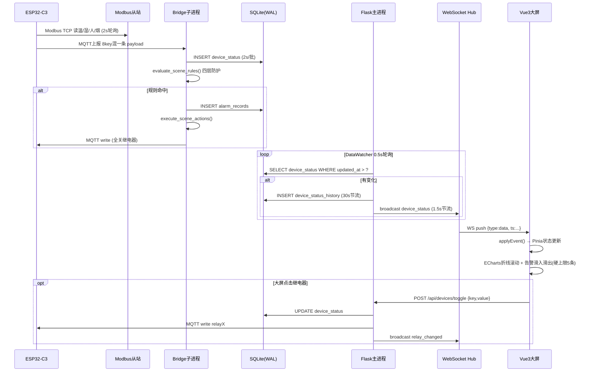

# 02 - 架构设计

## 一、全链路数据流

```
ESP32-C3 网关 (product_id=relay-cc, device_id=relaycc)
   │  Modbus TCP 读温/湿/人/烟 (从站 192.168.20.59:5502, unit_id=7)
   │  4 路 GPIO 继电器 (IO 3,4,5,7 高电平触发)
   ▼  MQTT 上报 (8 个 key 混在一条 payload)
Bridge (backend/bridge/gateway_bridge.py) —— 独立子进程
   │  ① 按路由表拆分转发到 8 个虚拟设备
   │  ② 评估场景规则 → 命中则 MQTT 下发继电器 + 写告警
   ▼  写 SQLite (WAL 模式, 8 张表)
Flask (backend/app.py) —— DataWatcher 后台线程 0.5s 扫库
   │  检测 device_status 变化 → 写历史(30s 节流) → 广播 WS(1.5s 节流)
   ▼
ws://localhost:8083/ws/dashboard → Vue3 大屏 (6 模块, 免登录)
                                → 管理后台 (7 页面, 需登录)
```

## 二、全链路时序（Mermaid）



## 三、进程与数据边界

系统由两个独立进程组成，通过 SQLite 解耦：

| 进程 | 职责 | 不能做 |
|------|------|--------|
| Bridge 子进程 | 订阅 MQTT、拆分转发、规则引擎、写库 | 不能直接调用 Flask 的 WebSocket |
| Flask 主进程 | REST/WS 服务、DataWatcher 轮询、鉴权 | 不直接连 MQTT（仅 toggle 时下发） |

**为何解耦**：Bridge 子进程崩溃重启不影响 Web 服务；Flask 重载不丢采集数据；SQLite WAL 支持两进程并发读写。

## 三、关键设计决策

### 1. 数据源自动选择（bridge_runner.choose_and_start）

优先级：
1. `DAY102_FORCE_FAKE=1` → 强制 FakeBridge（演示/无硬件）
2. MQTT broker TCP 可达 → 真实 `gateway_bridge.py`
3. MQTT 不可达 → 回退 FakeBridge（大屏不空白）

子进程崩溃 5 秒后自动重启（`BridgeRunner.watch`）。

### 2. WebSocket 推送节流

DataWatcher 后台线程轮询 SQLite，避免高频广播：

| 事件 | 触发 | 节流 |
|------|------|------|
| device_status | 状态变化 | 1.5s 最小间隔 |
| history_tick / overview_tick | 定时 | 每 5s |
| alarm_new | 新告警 id | 即时 |
| rule_triggered | trigger_count 增长 | 即时 |
| relay_changed | 大屏点击 toggle | 即时 |

### 3. 在线率计算（db.get_overview）

```
online = device_status 中 updated_at >= now - 60s 的通道数
online_rate = online / 8 * 100%
```

无独立在线表，复用 `device_status.updated_at`。60s 阈值让断网立即反映到大屏（原 5 分钟太长不便演示）。

### 4. 场景规则四层防护（db.evaluate_scene_rules）

1. **稳定计数**：连续 2 次相同值才触发（`STABLE_THRESHOLD=2`，持久化到 `scene_rules.last_observed_count`，跨进程/重启不丢）
2. **冷却时间**：`cooldown_sec` 内不重复触发
3. **条件评估**：`operator + threshold` 匹配
4. **动作互斥锁**：critical（全关）锁定 info（开灯）动作

### 5. 鉴权：Flask 服务端 Session

- 大屏相关接口免登录
- 管理接口需 `login_required`，写操作需 `admin_required`
- 同一用户新登录踢掉旧会话（`kick_user_sessions`）
- `before_request` 心跳更新 `last_seen`，5 分钟无心跳判离线

### 6. 前端 SPA 由 Flask 托管

不使用 Flask 内置 `static_folder`（会拦截子路由导致 SPA fallback 失效），改用 `index()` + `spa()` 手工托管，支持 `history` 模式刷新。

## 四、表结构概览（8 张表）

| 表 | 用途 |
|----|------|
| device_mappings | gateway_key → 虚拟产品/设备/属性 路由 |
| device_status | 设备最新值缓存（在线判定依据） |
| device_status_history | 时序历史（折线图，30s 节流，60 分钟清理） |
| scene_rules | 联动规则 + 稳定计数 + 触发计数 |
| alarm_records | 告警三态流转 |
| dashboard_config | 大屏运行参数 |
| users | 账号 + 角色（admin/user） |
| login_sessions | 在线/离线 + 心跳 |

## 五、表结构（字段级）

所有表均由 `db.init_db()` 在首次运行时创建，WAL 模式 + `busy_timeout=5000` + `synchronous=NORMAL`。

### device_mappings — 路由表

| 字段 | 类型 | 说明 |
|------|------|------|
| id | INTEGER PK | 自增 |
| gateway_key | TEXT UNIQUE | 网关侧 key：relay1 / temperature / human ... |
| product_id | TEXT | 虚拟产品：lock-cc / sensor-cc / human-cc ... |
| device_id | TEXT | 虚拟设备：lock001 / sensorcc / human001 ... |
| property_name | TEXT | 虚拟属性：switch / temperature / detected ... |
| enabled | INTEGER | 1=启用，0=禁用（启用时 Bridge 才转发） |

### device_status — 最新值缓存（在线判定依据）

| 字段 | 类型 | 说明 |
|------|------|------|
| gateway_key | TEXT PK | 同 device_mappings.gateway_key |
| value | TEXT | 字符串存储（展示时按类型解析） |
| updated_at | TIMESTAMP | **在线判定 = 此值在最近 60s 内** |

### device_status_history — 时序历史

| 字段 | 类型 | 说明 |
|------|------|------|
| id | INTEGER PK | 自增 |
| gateway_key | TEXT | relay1~4 / temperature / humidity / human / smoke |
| value | TEXT | 同 device_status |
| recorded_at | TEXT | ISO8601 UTC，每 key 30s 节流，60 分钟自动清理 |

### scene_rules — 场景联动规则

| 字段 | 类型 | 说明 |
|------|------|------|
| id | INTEGER PK | 自增 |
| name | TEXT | 规则名（如 "高温自动断电"） |
| trigger_key | TEXT | 触发采集点 |
| trigger_operator | TEXT | `>` `<` `>=` `<=` `==` `!=` |
| trigger_value | TEXT | 阈值（字符串，比较时转 float） |
| action_type | TEXT | `set_relay` / `all_relay_off` / `all_relay_on` / `send_alarm` |
| alarm_level | TEXT | info / warning / critical |
| cooldown_sec | INTEGER | 冷却时间（高温 60s / 烟雾 30s / 人感 10s） |
| trigger_count | INTEGER | **触发次数（持久化，重启不清零）** |
| last_observed_value / last_observed_count | TEXT / INTEGER | **稳定计数（持久化，跨重启不丢）** |

默认 4 条：高温>35 critical / 烟雾>50 critical / 有人=1 relay2 info / 无人=0 relay2 info。

### alarm_records — 告警三态流转

| 字段 | 类型 | 说明 |
|------|------|------|
| id | INTEGER PK | 自增 |
| rule_id | INTEGER | 关联规则（NULL=手动产生） |
| level | TEXT | info / warning / critical |
| status | TEXT | active → acknowledged → cleared |
| triggered_at / acknowledged_at / cleared_at | TIMESTAMP | 状态流转时间戳 |

### users + login_sessions — 鉴权

- users：id / username(UNIQUE) / password_hash / role(admin\|user) / display_name
- login_sessions：id / user_id / username / ip / login_at / logout_at / **last_seen**(心跳, 5min离线) / status(online\|offline)
- 同一用户新登录：`kick_user_sessions()` 把该用户所有旧 session 设 offline，仅保留最新 online

### dashboard_config — 大屏运行参数

key / value / updated_at（KV 表，支持热配置）

## 六、进程树与终止策略

```
cmd.exe                          ← 用户双击 start_all.bat
  └─ python app.py               ← Flask 主进程 (PID=A)
       └─ python fake_bridge.py  ← Bridge 子进程 (PID=B, bridge_runner.start())
```

**终止必须杀进程树**，否则 Bridge 子进程变成孤儿，继续持有 SQLite WAL 锁。

| 场景 | 策略 | 代码 |
|------|------|------|
| stop_all.bat | `taskkill /pid A /F /T` 杀 Flask + fake_bridge | cmd.exe |
| stop_all.bat 兜底 | `wmic process where "commandline like '%fake_bridge%' or commandline like '%gateway_bridge%'" call terminate` | cmd.exe |
| e2e teardown 主杀 | `taskkill /pid <Flask_PID> /F /T` — 进程树级联杀 | conftest.py |
| e2e teardown 兜底 | 从 Flask stdout 解析 bridge PID（`[runner] pid=NNN`），定向 `taskkill /pid NNN /F` — 比 CIM 扫全进程快且无副作用 | conftest.py |

**为何不用 `proc.terminate()`**：Windows 上只杀主进程，子进程不受影响。

**为何 e2e 不用 PowerShell CIM 扫全进程**：
1. CIM 查询所有 Python CommandLine 需 2-3 秒（WMI 开销远大于直接 taskkill）
2. 全局扫描会误伤同时运行的其他 demo backend 的 bridge 进程
3. bridge_runner.py 第 53 行已经 print PID，e2e 启动时就能抓到，定向 kill 最精准

## 七、FakeBridge 异常模拟

无硬件时 FakeBridge 每 2 秒写一批模拟数据，内置异常演示：

| 异常 | 机制 | 目的 |
|------|------|------|
| 温度冲高 | 每约 120s / 60% 概率，temperature→37，持续 ~20s | 触发高温自动断电（critical 全关） |
| 烟雾冲高 | 同上，smoke→62，持续 ~20s | 触发烟雾告警联动 |
| 随机断网 | 每约 80s，随机选一个传感器，断网 75s | 模拟离线场景（75s > 60s 在线阈值，在线率降至 7/8=87.5%） |

相关文档：[00-项目概述](00-overview.md) ｜ [04-API文档](04-api.md) ｜ [03-演进历史](03-evolution.md)
